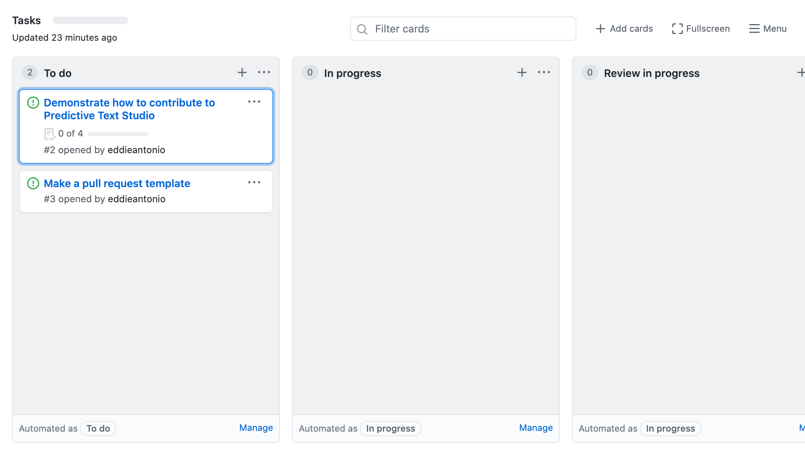
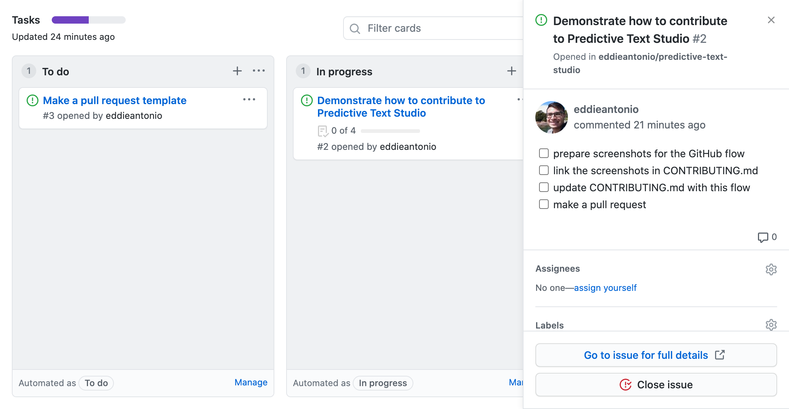
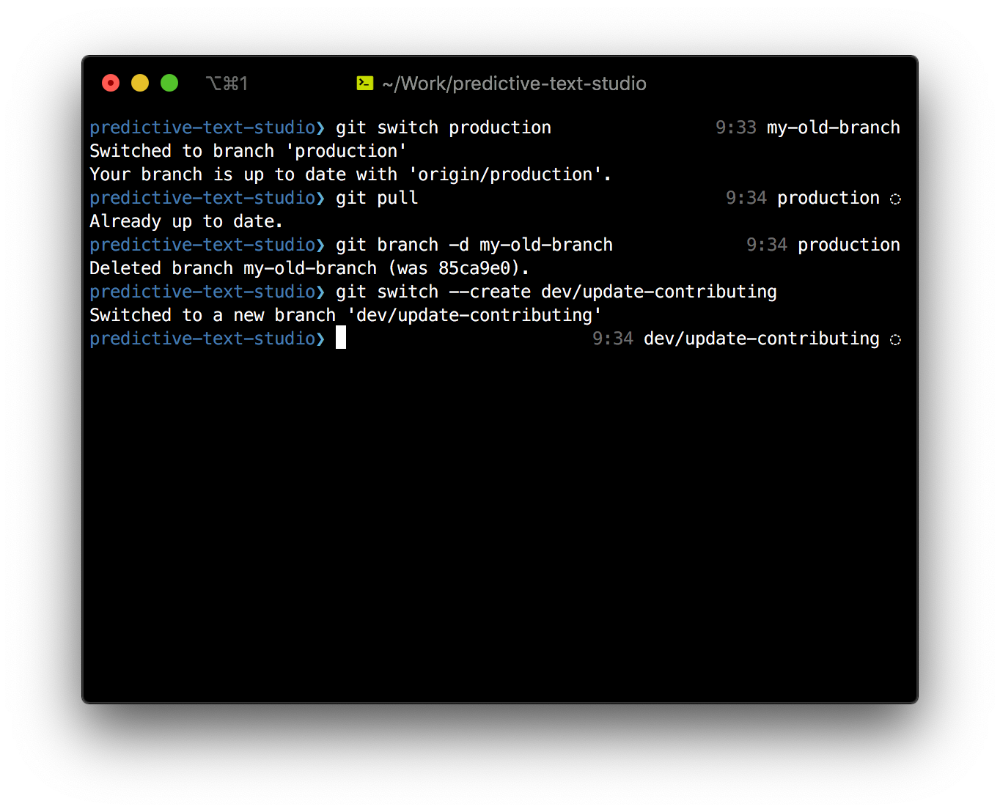
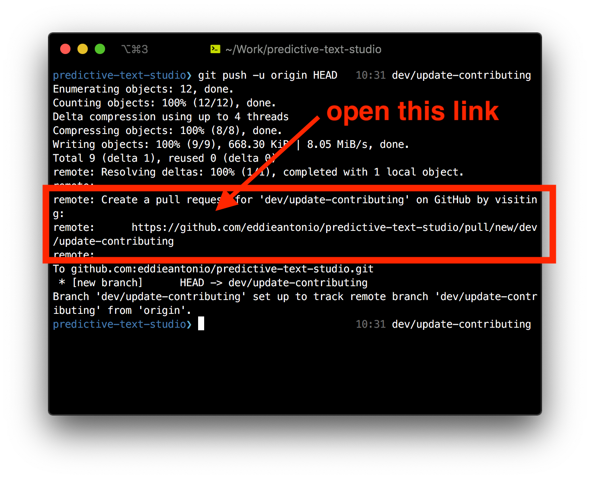
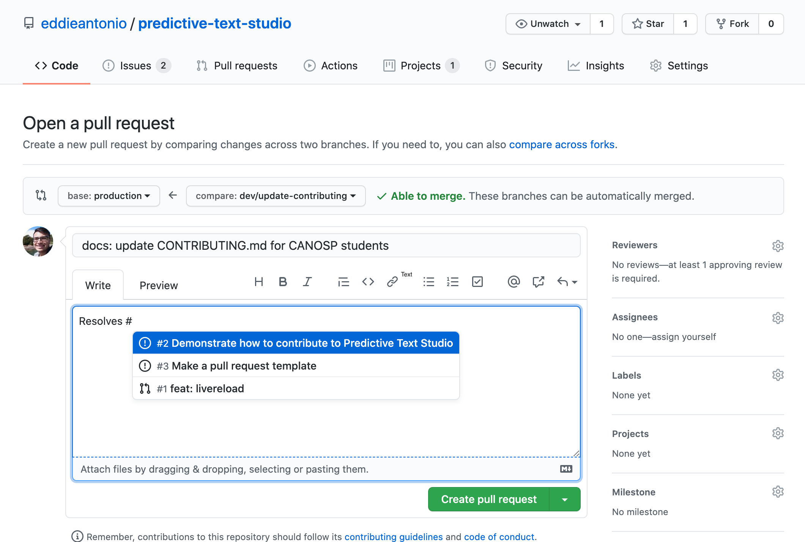
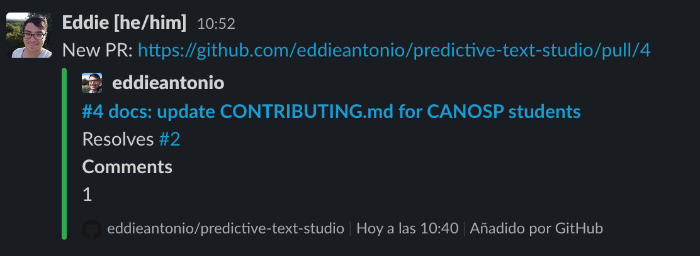

Contributing
============

Thank you for contributing to **Predictive Text Studio**!

Whether it's a bug report, updated documentation, fixing a typo, or even
adding a new feature, we appreciate your contribution.

Above all else, your behaviour is expected to abide by our [code of
conduct]! Be kind.

The following is a guide on how to make **code contributions** to this
project.

[code of conduct]: ./CODE_OF_CONDUCT.md

Table of contents
-----------------

- [How the branches work](#how-the-branches-work)
- [Setting up your development environment](#setting-up-your-development-environment)
  * [Install](#install)
  * [Build](#build)
  * [Start the development environment](#start-the-development-environment)
  * [Run the end-to-end tests interactively](#run-the-end-to-end-tests-interactively)
- [For CANOSP Participants](#for-canosp-participants)
  * [Choose a card](#choose-a-card)
  * [Assign yourself to the issue associated with the card](#assign-yourself-to-the-issue-associated-with-the-card)
  * [Create a new branch for the issue](#create-a-new-branch-for-the-issue)
    + [Branch prefixes](#branch-prefixes)
  * [Resolve the issue!](#resolve-the-issue-)
    + [Fixing a bug](#fixing-a-bug)
    + [Adding a new feature](#adding-a-new-feature)
  * [Create a pull request](#create-a-pull-request)
  * [Inform the team on Slack](#inform-the-team-on-slack)

How the branches work
---------------------

The [default branch][] is called **production**. Any code here is
automatically tested, built, and deployed on the website (currently,
<https://predictive-text-studio.eddieantonio.vercel.app/>).

**Do not make changes directly to production!**

Instead, **make a branch**, and then **make a pull request**. Somebody will have
a look at your changes, and, upon approval, will merge them into
production.

[default branch]: https://www.toolsqa.com/git/default-branch/

Setting up your development environment
---------------------------------------

If you are contributing code, follow these instructions to setup the
repository on your computer:

### Install

You will need:

 1. [Node.JS 12+](https://nodejs.org/en/)
 2. [Yarn](https://classic.yarnpkg.com/en/docs/install/#mac-stable)

After cloning this repository, you can install the rest of the
dependencies using:

    yarn install

### Build

Run this to build all the files

    yarn run build

### Start the development environment

To start development, run the following:

    yarn run dev

This does a few things:

 1. Starts `rollup` in "watch mode"
 2. Does an initial build of all of the JavaScript
 3. Starts [LiveReload](http://livereload.com/) (you need to install the
    LiveReload extension for your browser for this to work).

Once the first build has finished, you will be able to see the website
at <http://localhost:5000/>.

### Run the end-to-end tests interactively

With the server running as above (with `yarn start`), run this to open
[Cypress](https://www.cypress.io/):

    yarn run cy

For CANOSP Participants
-----------------------

CANOSP participants are expected to follow this process in order to
contribute to the project:

 1. Choose a card from the **To Do** column of the [Task board]
 2. Assign yourself to the issue associated with the card
 3. Create a new branch that addresses the issue in the selected card
 4. Resolve the issue!
 5. Create a pull request that [resolves][pr-keyword] the issue
 6. Inform the team on Slack!

[Task board]: https://github.com/eddieantonio/predictive-text-studio/projects/1
[pr-keyword]: https://docs.github.com/en/github/managing-your-work-on-github/linking-a-pull-request-to-an-issue#linking-a-pull-request-to-an-issue-using-a-keyword

### Choose a card

Choose what you're going to work on next!

Go to the [Tasks project board][Task board] and take a look at the **To
do** column.

Choose an issue near the top of the **To do** column that you're ready
to tackle next.

### Assign yourself to the issue associated with the card

Take the selected card and drag it into the **In progress** column.
Then click the issue title, and find its **Assignees**. It should say
"No one—assign yourself". In this case, click on **assign yourself**.
Now you are on the hook for completing this issue ;)

### Create a new branch for the issue

> **Note**: this section assumes you are using `git` **version 2.23 or newer**

On your local copy, make sure you're up-to-date with the current version
of **production**:

    git switch production
    git pull

Then, create a **new branch** with a name descriptive of the issue you
are going to resolve.

    git switch --create NAME-OF-YOUR-NEW-BRANCH

Try to name the branch something indicative of what it will attempts to
resolve!

**Optional**: delete your old branch. If you were working on something
previously and **that branch has already been merged**, I would delete
that old, merged branch:

    git branch --delete NAME-OF-YOUR-OLD-BRANCH

#### Branch prefixes

I will use the following **prefixes** for my **branch names**, and I suggest you
do the same:

 - `docs/` — adds or modifies documentation
 - `feat/` — implements a new feature
 - `fix/` — fixes a bug
 - `build/` — changes to `package.json`, `tsconfig.json`, `rollup.config.js`, etc.
 - `change/` — anything else!

### Resolve the issue!

Next, do whatever you need to do to resolve the issue! Here are some
guidelines of the tasks you should be doing in certain scenarios:

#### Fixing a bug

1. **Write a test** that **replicates the bug** that you're
   trying to solve. This isn't always simple to do, so if creating
   a regression test is taking way too much effort, it's okay to skip
   this step. However, it is **strongly** encouraged!
2. **Find what's causing the bug**! Use a debugger, or ask me on Slack about what debugging
   techniques to use. If you're stuck, discuss the issue in our Slack,
   and I'm sure you'll figure it out in no time :)
3. **Fix the bug**. Make your fix and commit it. If you've written a new
   test, make sure your fix passes the test!

#### Adding a new feature

1. Add a **unit test** or an **end-to-end test** or both! It doesn't
   matter if you do this before or after you write the implementation,
   but I like to write the test before (test-driven development) if the
   test is easy enough to write!
2. Implement the feature! Make sure the test you wrote passes! Just try
   to make the code work; don't worry about making it perfect.
3. Once the feature works (all of its tests pass), improve it! You may
   **refactor** to make the code prettier, **easier to read**, or **easier
   to change**. Or you may **make the code faster** or **reduce its
   memory requirement**. Either way, improvements should be done AFTER
   the basics of the feature are done!

### Create a pull request

> **Note**: if you want to be REALLY awesome, create a [draft pull request][]
> even before your changes are ready. This helps us keep up-to-date with
> your latest developments, and helps the rest of team out!

Once you're happy with your changes, **create a pull request**.
Push your changes to the main repository.

**PROTIP:** this command will ALWAYS† setup your branch properly on the
first push:

    git push -u origin HEAD

<small>†as long as your remote is called `origin`!</small>

Typically, your first `git push`  will print a link from GitHub that you can click
to create a new pull request.

Now write an informative message about your changes. **Make sure it
references which issue it will resolve**!

**PROTIP**: use a [keyword][pr-keyword] such as **resolves**, **fixes**, or **closes**
to automatically close the issue as soon as the PR is merged!

[draft pull request]: https://github.blog/2019-02-14-introducing-draft-pull-requests/

### Inform the team on Slack

Make a post on the `#predictive-text-studio` channel on the CANOSP
Slack! Link to your PR, maybe write a witty comment, and wait for your
PR to be reviewed!

