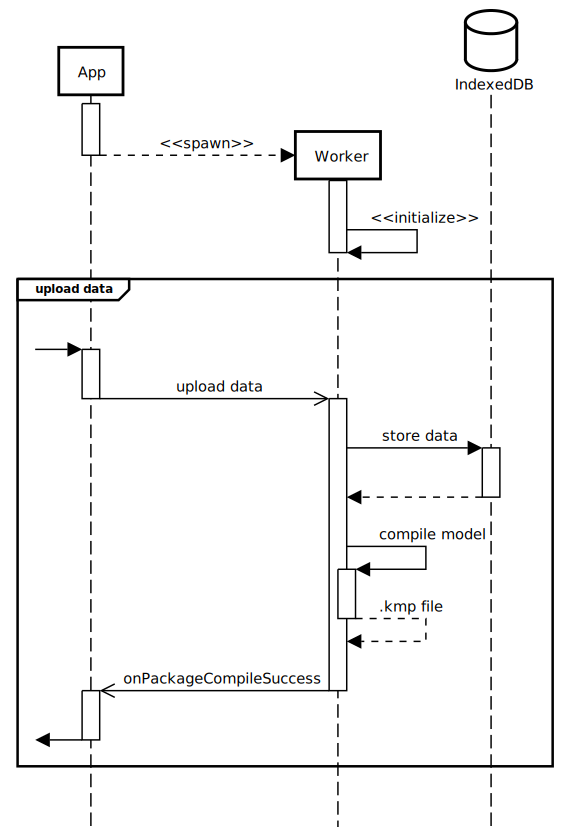

Architecture of the Predictive Text Studio application
======================================================

_Updated 2021-02-14_.

Background
----------

Predictive Text Studio aims to make it simple for language activists to
upload _wordlists_ and create a “[lexical model][]” for a compatible
[Keyman][] mobile keyboard.

The Predictive Text Studio web application is **entirely**
executed in the users' browser.

Why? **Our users' data is sensitive**. Our target end-users are _language
activists_ that wish to better their language community (see:
[Language Revitalization]). Since communities are protective of their
language autonomy, **we do not store user data** on any external
services, and the user of web server is limited to downloading static
assets. We currently do not set any cookies, and **all uploaded data
is stored in the user's browser**.

[lexical model]: https://help.keyman.com/developer/13.0/guides/lexical-models/intro/
[Language Revitalization]: https://en.wikipedia.org/wiki/Language_revitalization#Specific_examples
[Keyman]: https://keyman.com/

App, Worker, and Common
-----------------------

<!-- To modify this diagram, copy-paste ./UML/architecture-overview.txt
     into https://sequencediagram.org/, make your modifications, then
     re-export it as an SVG! -->

To make a snappy application, we have divided it into the **app**, the
**worker** and the **common** code.

## App

The **app** is the front-end code that handles all user interaction, and
runs in the [browser's main thread][main thread]. Near the start of page
load, the app code starts a [Web Worker], and loads the **worker** code,
asynchronously.

 - The **app** code can be found in `src/app`
 - The **app** is responsible for starting the **worker**
 - The **app** bundle (compiled and minified JavaScript file) should be
   kept **as small as possible**; why? The **app** code gets loaded
   **immediately** and **synchronously** by the user's browser, so it
   blocks interaction until it's finished being downloaded, parsed, and
   executed.

[main thread]: https://developer.mozilla.org/en-US/docs/Glossary/Main_thread
[Web Worker]: https://developer.mozilla.org/en-US/docs/Web/API/Web_Workers_API/Using_web_workers

## Worker

The **worker** is the back-end code that handles the majority of the
data processing tasks. The code here executes in a concurrent thread as
to [minimize the amount of work done on the main thread][minimize main
thread]. This code is also **100% responsible** for managing and
communicating with **the storage backend**.

 - The **worker** code can be found in `src/worker`
 - The **worker** _must_ be started by the **app** code
 - The **worker** bundle (compiled and minified JavaScript file) is
   less-restricted in in its size, but try not to exceed **1440 KiB**
   (after minification and compression).

Currently, the storage backend is [IndexedDB], however we use the
[Dexie][] library to manage the database schema and simplify interaction
with IndexedDB's low-level API.

[minimize main thread]: https://web.dev/mainthread-work-breakdown/
[IndexedDB]: https://developer.mozilla.org/en-US/docs/Web/API/IndexedDB_API
[Dexie]: https://dexie.org/docs/API-Reference#quick-reference

## Common

For the most part, code in **common** consists of **TypeScript** type
definitions. That is, it is largely **non-executable code**, and only
serves to provide type definitions that can be shared between the
**app** and the **worker**.

The most important of these type definitions is the
[`PredictiveTextStudioWorker` interface][worker-interface], that defines
the possible communication that can occur between the **app** and the
**worker**.

[worker-interface]: https://github.com/eddieantonio/predictive-text-studio/blob/production/src/common/predictive-text-studio-worker.ts
